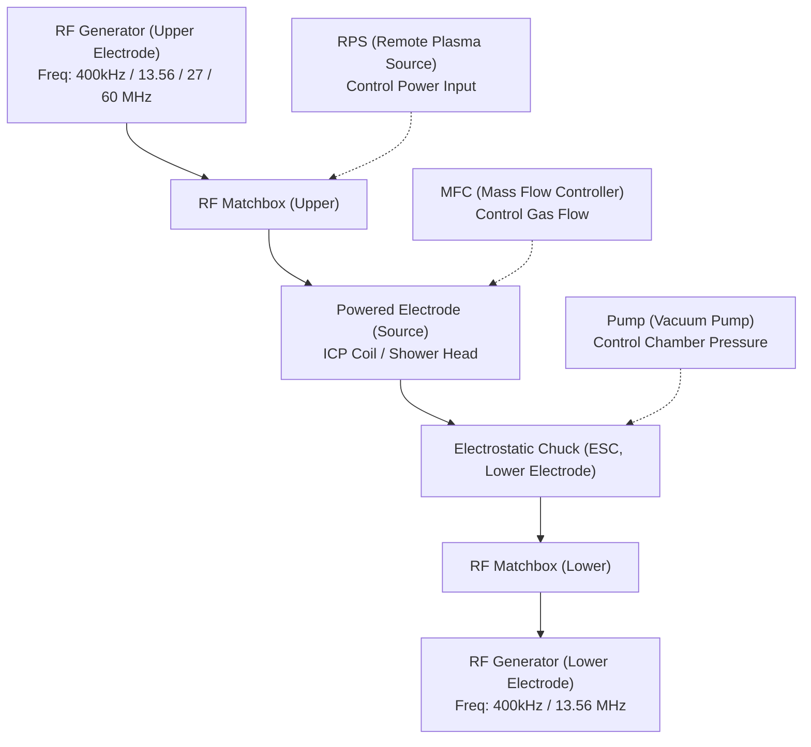

# 題目：半導體電漿電源的演進應用與設計關鍵
# 講者：洪再和
# 日期：2025/10/07
# 筆記內容：

## 電漿電源:半導體設備中最複雜及高技術的零組件

## 電將電源的世代演進與啟示

| 時期           | 維修方式   | 世代   | 全球數量 | 製程節點          | 類型與控制方式             | 重量  | 元件       | 效率 (@full load) | 備註                    |
|----------------|------------|--------|-----------|-------------------|----------------------------|-------|-------------|------------------|-------------------------|
| 1980～原廠停修 | 整機替換   | 第一代 | ~10K EA   | (6吋/8吋) >90nm   | Class AB 類放大器 類比控制 | 65kg  | Si MOSFET   | <50%             |                         |
| 1990～原廠停修 | 升級維修   | 第二代 | ~120 EA   | 8吋/12吋 >16nm    | Class E 類放大器 類比控制  | 14kg  | Si MOSFET   | 65%              |                         |
| 2000～         | 維修保養   | 第三代 | ~200K EA  | 16–90nm           | Class E 類放大器 數位+類比控制 | 21kg  | Si MOSFET   | 65%              |                         |
| 2010～         | 維修保養   | 第四代 | ~200K EA  | <16nm             | Class E 類放大器 數位+同步+雙頻 | 16kg  | Si MOSFET   | 70%              |                         |
| 2022～         | 保固中     | 第五代 | ~50K EA   | <3nm              | Class E 類放大器 數位+同步+雙頻 | 16kg  | Si MOSFET   | —                | 無須 Matchbox / DirectDriver |

## 半導體蝕刻電漿系統:
### 控制方式xRF頻率混合x附載特性  
CEX Control:同頻率，不同相位角度精準控穩電漿  
Pulsing Control:高頻弦波下的方波開關導通控制 
Mix RF Frequency Source: 2+27+60 (Bias:13+60) 

## 現行高頻電漿電源三大瓶僅: 電力品質、效率、散熱
* 電力品質:諧波失真率最低卡在 **30%**
* 矽元件的電漿電源轉換率:仍有 **30%** 的提升潛力
* 5kW真空管的電漿電源效率低於 **30%** ，啟動就需耗電12kW廠務供電(17000W)=損失(12000W)+輸出(5000W) 
  效率 = 輸出/輸入 = 5000W/17000W = **29.4%**  
  損失 = 輸入-輸出 = 17000W-5000W = 12000W(熱損失)
